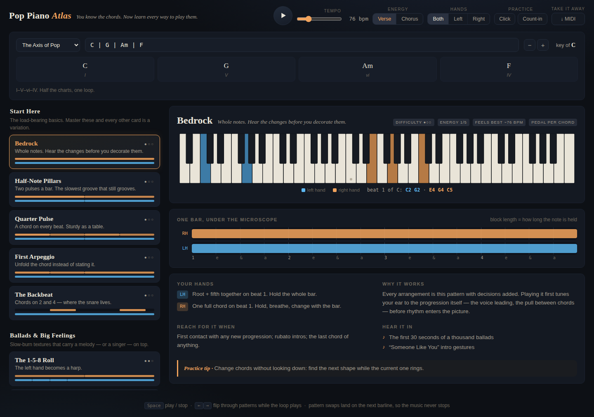

# Pop Piano Atlas 🎹

**You know the chords. Now learn every way to play them.**

An accompaniment atlas for pianists: enter any chord progression, press play, and flip
through 22 curated, named accompaniment patterns — the ones real pop pianists actually use —
while the loop keeps playing. Every pattern teaches itself: what each hand does, why it works,
where you'd use it, and which records to hear it on.



## Try it

No build, no dependencies, no server logic — it's a static web app.

```bash
# any static server works:
python3 -m http.server 8000
# then open http://localhost:8000
```

Or open `dist/pop-piano-atlas.html` — the whole product in a single self-contained file.

## The ten-second loop

1. A progression is already loaded (`C | G | Am | F` — the axis of pop). Click any pattern card.
2. The loop starts and **never stops** — click other cards (or use **←/→**) and each swap lands
   cleanly on the next barline.
3. Found one you love? Slow it down, mute a hand, switch **Verse → Chorus** to hear it lifted,
   turn on the click, read the practice tip — then go play it. **↓ MIDI** exports exactly what
   you hear, left and right hands on separate tracks.

Type your own chords (`Bbmaj7 | Gm7 | Ebadd9 | F/A …`), or pick a preset like *Pachelbel's
Wheel* or *The Chromatic Drift*. Transpose with −/+. Roman numerals come free.

## What's in the atlas

| Group | Patterns |
|---|---|
| **Start Here** | Bedrock · Half-Note Pillars · Quarter Pulse · First Arpeggio · The Backbeat |
| **Ballads & Big Feelings** | The 1-5-8 Roll · Cascade 16ths · The Anchor · The Crossover · Late Bloom · The Heartbeat · The Push |
| **Singer-Songwriter** | Folk Roll · Campfire Strum · The Pedal Point · Alberti Drift · Sixteenth Bite |
| **Pop & Rock Engines** | The Pump · Driving Octaves · The Woodchop · Disco Pump · The Elton Box · The 3-3-2 · Stadium Octaves |
| **Groove & Soul** | The '50s Walk · The Toggle · Push in the Middle · Off-Beats Only · The Charleston Shuffle · Gospel Sus · 16th Snap |

Patterns are pure data (`js/patterns.js`): roles on a 16th-note grid, rendered over any chord
in any key by a voice-leading engine with pianistic constraints (hand span, registers, a
low-interval mud guard, per-chord pedal). Adding pattern #32 is a JSON contribution, not
an engineering project.

## Harmonic colour — automatic passing chords

The **Colour** control re-arranges the harmony itself, using the gospel/pop playbook:

- **Passing** — diatonic connectors: on the last beat before a chord change, the bass
  walks through an inversion (`C → C/E → F`, bass 1-3-4) or steps down onto the coming
  chord's third (`F → C/E → C`).
- **Gospel** — the chromatic devices: secondary dominants with the leading tone in the
  bass (`G → G7/B → C`), and passing diminished chords between whole-step roots
  (`C → C#°7 → Dm`). Held patterns gain a soft right-hand shell so the passing harmony
  is heard, not just implied.

Patterns that pedal (static bass is their point) or push their own anticipations keep
their character — no connector is forced on them. Grace-note slides (the gospel ♭3→3
crush) decorate selected patterns the same way a player's hands would.

## Full arrangements

One rung up from patterns: **ten whole-song arcs** that conduct the atlas for you.
An arrangement is a sequence of sections — each looping your progression with one
pattern, an energy level (1–5), a dynamics arc, and optionally its own harmonic
colour — joined by real pianist's fills: a left-hand 6̂–7̂ walk-up into the next root,
a sus4 push that anticipates the coming chord, the Piano Man dyad fill (fifth fixed
on top while the lower voice walks), or a stop-time stab — one hit, then silence.
Later sections can brighten every chord with an added 9th: the "upgrade the colours
on the repeat" move every arranger uses.

| Arrangement | Influence | Arc |
|---|---|---|
| **The Slow Burn** | Adele, power ballads | whole notes → 1-5-8 roll → 16th cascade → stadium chorus → afterglow |
| **Cardigan Weather** | Taylor Swift live piano | pedal point → folk roll → heartbeat → campfire chorus → outro |
| **Piano Man Fuel** | Ben Folds, Elton John | quarter pulse → pushed chords → driving octaves → finale |
| **Yellow Lights** | Coldplay anthem build | pedal point → 3-3-2 → 8th pump → stadium octaves |
| **Sunday Service** | Gospel-soul | pillars → backbeat → '50s walk → gospel sus (rich colour) → benediction |
| **Small Hours** | Neo-soul, late night | shuffle → off-beats → 16th snap → fade |
| **Lean On It** | Bill Withers, 70s soul | pillars → toggle → middle push → stop-time → woodchop → amen |
| **Rocket Fuel** | Elton John | late bloom → 1-5-8 roll → push → the Elton box → encore |
| **Night at the Opera** | Queen, Freddie Mercury | crossover → woodchop → driving octaves → stop-time finale |
| **Mirrorball** | Disco | off-beats → disco pump → 16th snap → add9 lights → fade |

Pick one and the section timeline lights up as it plays; the stage keeps teaching whatever
pattern is currently sounding. **↓ MIDI** exports the entire arc — every section, swell and
fill. Click any pattern card to take back manual control. In manual mode, the **energy
ladder** (Hush → Verse → Build → Chorus → Finale) plays the same pattern five sizes.

Arrangements are pure data too (`js/arrangements.js`) — a new arc is a dozen lines of JSON.

## Why it's shaped this way

Read [VISION.md](VISION.md) — the product thesis, including where this deliberately departs
from the original brainstorm (curation over combinatorics, technique names over artist names,
deterministic patterns over generative AI, one energy dial instead of a transform system).

## Development

```
js/theory.js        chord parsing · key analysis · voicing engine · passing-chord recipes
js/patterns.js      the atlas (data) + progression presets
js/arrangements.js  full-song arcs (data): sections × energy × dynamics × colour × fills
js/engine.js        (progression × pattern × energy × colour × arc) → notes · scheduler · MIDI
js/audio.js         synthesized piano · stereo register placement · reverb · metronome
js/ui.js            deck · arrangements strip · keyboard viz · rhythm map · learn panel
```

The pattern and arrangement vocabulary is distilled from a folder of pro piano lesson
material (`more_inspiration/`): the Piano Man fill, the passing-chords playbook, Elton's
boxed voicings, McCartney and Mercury signature moves, the Keys Coach rhythm playbooks,
and the lead-sheet arrangement method.

```bash
node tests/theory.test.js && node tests/engine.test.js \
  && node tests/musicality.test.js && node tests/arrangements.test.js   # full suite
python3 tools/build_single.py                            # rebuild dist/pop-piano-atlas.html
```
